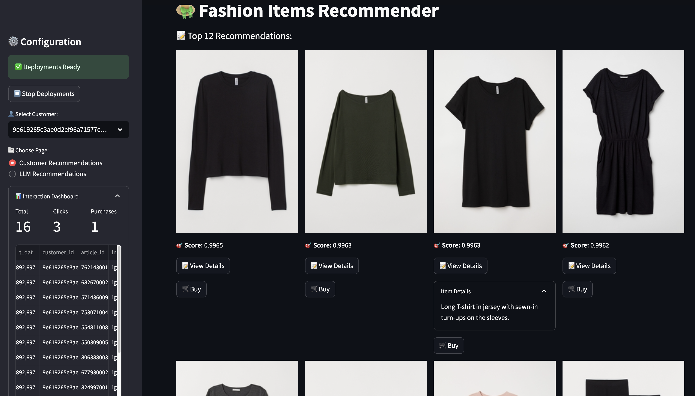
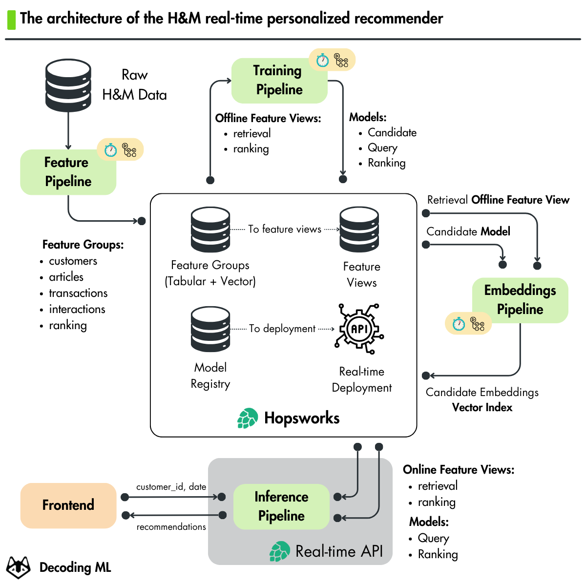
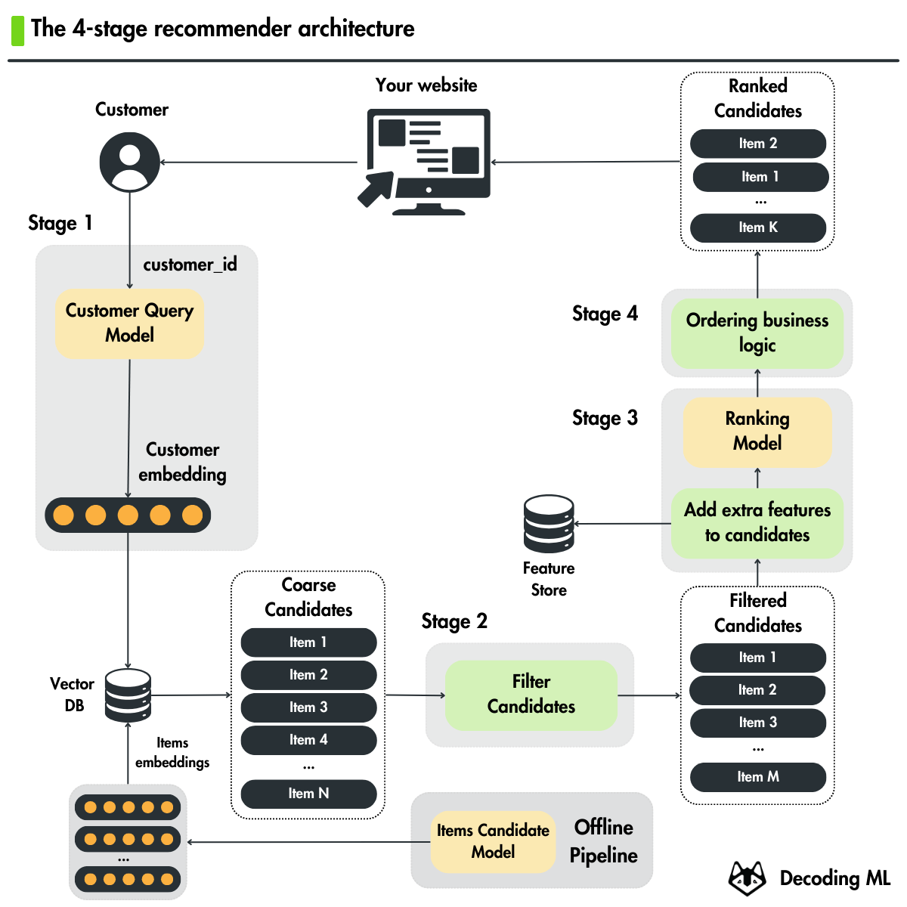
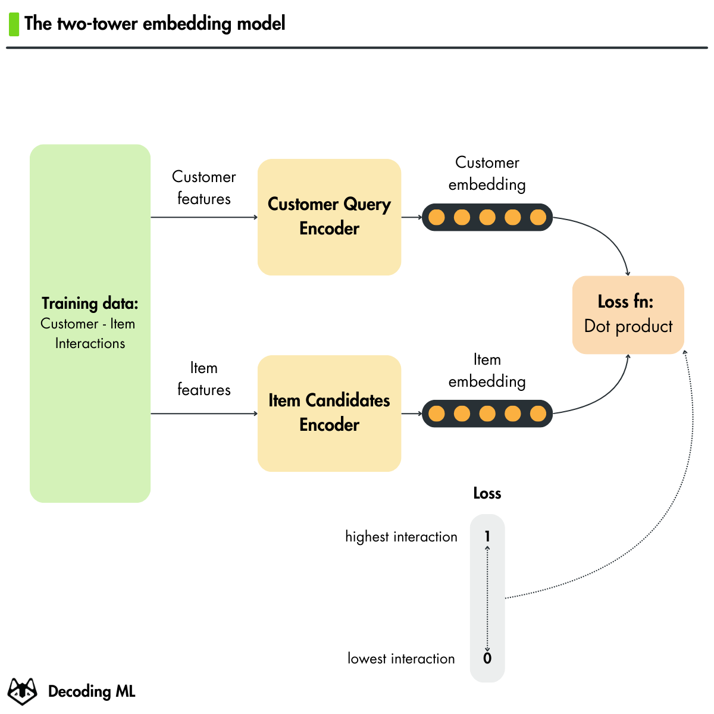

# Hands-on Personalized Recommender System


## 📖 Project Context

This project was built for learning, practicing, and applying knowledge of Machine Learning, Recommender Systems, and MLOps into practice. It simulates a complete machine learning pipeline from data processing and storage to model serving and deployment.

## 🎯 Project Description

**Hands-on Personalized Recommender System** is a complete (end-to-end) personalized fashion product recommendation system. This project applies the **4-Stage Recommender Architecture** including:
1. **Retrieval:** Uses a Two-Tower Embedding model (TensorFlow) to retrieve a set of potential candidate items.
2. **Filtering:** Removes products that are not suitable for the current context.
3. **Scoring/Ranking:** Uses a Gradient Boosting model (CatBoost) or LLMs (via OpenAI) to score and re-rank the candidates.
4. **Ordering:** Sorts and displays the final recommendation list to the user via a Streamlit Web UI.

## 📺 Architecture & UI Demo

**1. Streamlit Application UI:**  


**2. Overall System Architecture:**  


**3. 4-Stage Recommender Architecture:**  


**4. Two-Tower Model Structure:**  


---

## 🛠 Installation Guide

The project uses `uv` package manager for virtual environment management and blazing-fast library installation.

**Step 1: Clone the repository**
```bash
git clone https://github.com/hiepvm04/end-to-end-4-stage-fashion-recommender-system.git
cd end-to-end-4-stage-fashion-recommender-system
```

**Step 2: Install Python 3.11+ and dependencies (via uv)**
If your system supports `make` (Linux/macOS), you can run:
```bash
make install-python
make install
```
🚨 **Note for Windows users:** If you don't have `make`, run the following commands in PowerShell:
```powershell
uv python install          # Automatically downloads and installs Python
uv venv                    # Creates a .venv virtual environment
.venv\Scripts\activate     # Activates the environment
uv pip install --all-extras --requirement pyproject.toml  # Installs libraries
```

**Step 3: Environment Variables Configuration**
Copy the template file and update your API keys to connect to external systems:
```bash
cp .env.example .env
```
Open the `.env` file and fill in the information:
```env
HOPSWORKS_API_KEY="your_hopsworks_api_key_here"
OPENAI_API_KEY="your_openai_api_key_here" # Required if using the LLM Ranking model
```

---

## 🚀 Usage & Pipeline Execution

You can run the entire pipeline step-by-step using `make` commands (Linux/macOS) or directly using `uv` (Windows):

### 1. Run the Training and Deployment Pipeline
Execute the notebooks sequentially in order:
* **Linux/macOS (using `make`):** 
Open the terminal and run the commands one by one, or use `make all` to run everything:

# 1. Feature Engineering (Process features and store them in the Feature Store)
make feature-engineering

# 2. Train Retrieval Model (Two-Tower Model)
make train-retrieval

# 3. Train Ranking Model (CatBoost Model)
make train-ranking

# 4. Compute and Store Vector Embeddings
make create-embeddings

# 5. Initialize Deployments on Hopsworks
make create-deployments

# 6. Schedule Automated Materialization Jobs
make schedule-materialization-jobs

* **Windows (using `uv` directly):**
  ```powershell
  uv run ipython notebooks/1_fp_computing_features.ipynb
  uv run ipython notebooks/2_tp_training_retrieval_model.ipynb
  uv run ipython notebooks/3_tp_training_ranking_model.ipynb
  uv run ipython notebooks/4_ip_computing_item_embeddings.ipynb
  uv run ipython notebooks/5_ip_creating_deployments.ipynb
  uv run ipython notebooks/6_scheduling_materialization_jobs.ipynb
  ```

### 2. Launch the UI (Streamlit)
After the deployments on Hopsworks have been successfully created, you can start the UI:

**Using the CatBoost ranking model (Default):**
* Linux/macOS: `make start-ui`
* Windows (PowerShell): `$env:RANKING_MODEL_TYPE="ranking"; uv run python -m streamlit run streamlit_app.py`

**Using the LLM ranking model (OpenAI):**
* Linux/macOS: `make start-ui-llm-ranking`
* Windows (PowerShell): `$env:RANKING_MODEL_TYPE="llmranking"; uv run python -m streamlit run streamlit_app.py`

---

## 📦 Core Dependencies

- `hopsworks[python]`: Feature Store and Model Registry management.
- `tensorflow-recommenders` & `tensorflow`: Training the Retrieval model (Two-Tower).
- `catboost`: Building the high-performance Ranking model.
- `streamlit`: Designing the interactive Web UI.
- `langchain` & `langchain-openai`: Integrating LLM capabilities.
- `sentence-transformers`: Generating Text Embeddings.
- `polars`: Blazing-fast tabular data (DataFrames) processing.

*(See the full list in `pyproject.toml`)*

---

## ⚠️ Troubleshooting

1. **`tensorflow-io-gcs-filesystem` error on Windows:**
   - **Symptom:** When running `uv pip install`, it throws a missing wheel error for the `win_amd64` platform.
   - **Fix:** Add the following snippet to the end of your `pyproject.toml` file to force a compatible older version for Windows, then run the installation again:
     ```toml
     [tool.uv]
     override-dependencies = ["tensorflow-io-gcs-filesystem==0.31.0"]
     ```
2. **Unauthorized error with Hopsworks:**
   - **Fix:** Double-check your `HOPSWORKS_API_KEY` in the `.env` file. Ensure the API Key is not expired and has sufficient read/write permissions.
3. **Out of Memory (OOM) overloaded RAM:**
   - **Fix:** The `train-retrieval` notebook can consume a lot of RAM when creating large datasets. Set `CUSTOMER_DATA_SIZE = CustomerDatasetSize.SMALL` in the `recsys/config.py` file.
4. **Avoiding idle costs on Hopsworks:**
   - When not in use, shut down the Inference Deployments by running: `make clean-hopsworks-resources` (or `uv run python tools/clean_hopsworks_resources.py` on Windows). Restarting the pipeline via API for the first time will take a moment (Cold Start).

---

## 📚 References

During the learning and development process, I have consulted and am grateful for the following useful resources:
- [Hopsworks Framework Official Documentation](https://docs.hopsworks.ai/)
- [TensorFlow Recommenders Tutorials](https://www.tensorflow.org/recommenders)
- [Streamlit Technical Documentation](https://docs.streamlit.io/)
- [ML Pipeline Architecture for Recommender Systems (Google Cloud)](https://cloud.google.com/architecture/machine-learning-on-gcp)

**Reference Course:** [Hands-On Personalized Recommender System 2024](https://github.com/decodingml/hands-on-recommender-system-with-hopsworks)

---

## ✉️ Contact Information

This project is a personal product for coursework and practical research. If you find it useful or have suggestions for improving the code/architecture, please open an Issue or reach out via:

- **Author:** Vu Manh Hiep
- **Email:** hiepvm04@gmail.com
- **LinkedIn:** [Add your LinkedIn link here...]
- **Github:** https://github.com/hiepvm04
