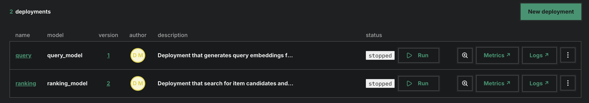
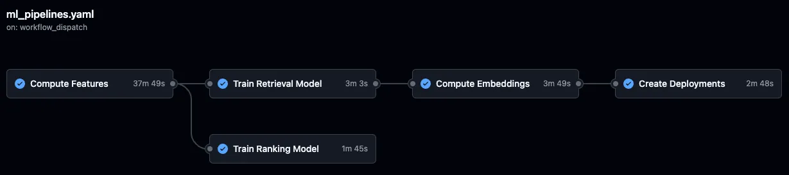
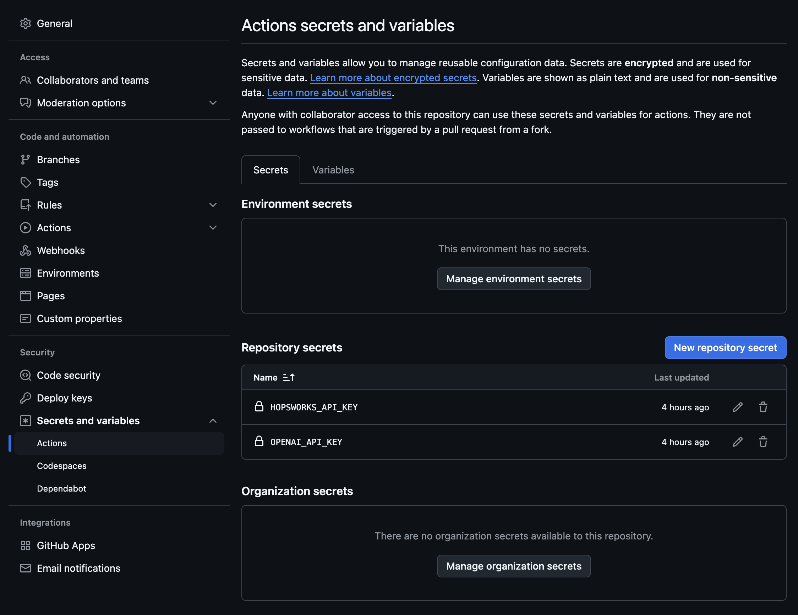
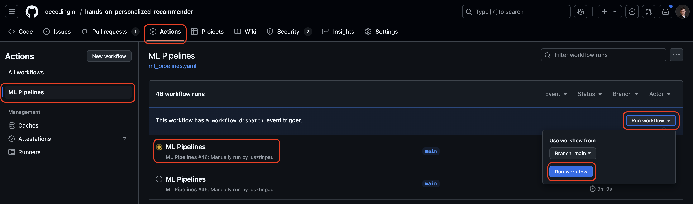
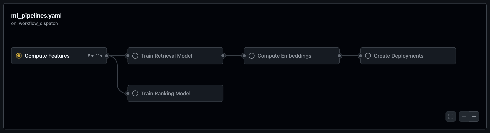

# 👒 End-to-End Fashion Recommender System

<div align="center">


**Hệ thống gợi ý sản phẩm thời trang cá nhân hóa end-to-end, áp dụng kiến trúc 4 giai đoạn với Two-Tower Retrieval, CatBoost Ranking và LLM Ranking tích hợp OpenAI.**

</div>

---

## 📋 Mục lục

- [Bối cảnh dự án](#-bối-cảnh-dự-án)
- [Tổng quan hệ thống](#-tổng-quan-hệ-thống)
- [Kiến trúc 4 giai đoạn](#-kiến-trúc-4-giai-đoạn)
- [Cấu trúc dự án](#-cấu-trúc-dự-án)
- [Hướng dẫn cài đặt](#-hướng-dẫn-cài-đặt)
- [Cách sử dụng](#-cách-sử-dụng)
- [Giao diện ứng dụng](#-giao-diện-ứng-dụng)
- [Kiểm thử (Testing)](#-kiểm-thử-testing)
- [CI/CD Pipeline](#%EF%B8%8F-cicd-pipeline)
- [Thư viện phụ thuộc](#-thư-viện-phụ-thuộc)
- [Lỗi đã biết & Khắc phục](#-lỗi-đã-biết--khắc-phục)
- [Tài liệu tham khảo](#-tài-liệu-tham-khảo)
- [Thông tin liên hệ](#-thông-tin-liên-hệ)

---

## 🎯 Bối cảnh dự án

Dự án được xây dựng với mục đích **học tập và thực hành** các kiến thức về:
- **Machine Learning & Deep Learning** – xây dựng mô hình Two-Tower (TensorFlow) và Gradient Boosting (CatBoost)
- **Recommender Systems** – triển khai pipeline gợi ý sản phẩm hoàn chỉnh
- **MLOps** – tích hợp Hopsworks Feature Store, Model Registry, và Inference Deployments

Dữ liệu sử dụng là tập dữ liệu **H&M Fashion** (khách hàng, sản phẩm, giao dịch mua sắm) cung cấp bởi Hopsworks.

---

## 🏗️ Tổng quan hệ thống

Dự án mô phỏng một **ML Pipeline hoàn chỉnh** với 3 giai đoạn chính:

| Giai đoạn | Mô tả |
|-----------|-------|
| **Feature Pipeline (FP)** | Thu thập dữ liệu thô từ H&M, biến đổi đặc trưng và lưu vào Hopsworks Feature Store |
| **Training Pipeline (TP)** | Huấn luyện mô hình Two-Tower (Retrieval) và CatBoost (Ranking), đăng ký vào Model Registry |
| **Inference Pipeline (IP)** | Tính toán vector embeddings, tạo deployments và phục vụ gợi ý qua Streamlit UI |

**Kiến trúc hệ thống tổng thể:**


---

## 🔁 Kiến trúc 4 giai đoạn

Hệ thống gợi ý áp dụng kiến trúc **4-Stage Recommender Architecture** được sử dụng phổ biến trong các hệ thống production quy mô lớn:


### Giai đoạn 1 – Retrieval (Truy xuất)
- Sử dụng mô hình **Two-Tower Embedding** (TensorFlow + TensorFlow Recommenders)
- **Query Tower**: nhận `customer_id`, `age`, `month_sin`, `month_cos` → tạo user embedding
- **Item Tower**: nhận `article_id`, `garment_group_name`, `index_group_name` → tạo item embedding  
- Tìm kiếm **top-K sản phẩm tiềm năng** bằng phương pháp ANN (Approximate Nearest Neighbor) trên Hopsworks


### Giai đoạn 2 – Filtering (Lọc)
- Loại bỏ các sản phẩm không phù hợp (đã mua, không còn hàng, v.v.)
- Giảm bớt candidate pool trước khi đưa sang bước xếp hạng

### Giai đoạn 3 – Scoring / Ranking (Chấm điểm & Xếp hạng)
Hỗ trợ **hai chế độ ranking**:

| Chế độ | Mô hình | Mô tả |
|--------|---------|-------|
| **Standard Ranking** | CatBoost (`ranking.pkl`) | Gradient Boosting phân loại nhị phân (mua / không mua) dựa trên đặc trưng sản phẩm và khách hàng |
| **LLM Ranking** | OpenAI GPT-4o-mini | Re-ranking bằng LLM qua LangChain – phù hợp cho gợi ý theo ngữ cảnh và ngôn ngữ tự nhiên |

### Giai đoạn 4 – Ordering (Sắp xếp & Hiển thị)
- Sắp xếp danh sách cuối cùng và hiển thị trên **giao diện Streamlit**
- Theo dõi tương tác của người dùng (clicks, purchases) và cập nhật lại Feature Store theo thời gian thực

---

## 📁 Cấu trúc dự án

```
ReSys/
├── 📓 notebooks/                          # Jupyter Notebooks thực thi pipeline
│   ├── 1_fp_computing_features.ipynb      # [FP] Feature Engineering
│   ├── 2_tp_training_retrieval_model.ipynb# [TP] Huấn luyện Two-Tower
│   ├── 3_tp_training_ranking_model.ipynb  # [TP] Huấn luyện CatBoost Ranking
│   ├── 4_ip_computing_item_embeddings.ipynb   # [IP] Tính toán Item Embeddings
│   ├── 5_ip_creating_deployments.ipynb    # [IP] Tạo Deployments (Standard)
│   ├── 6_scheduling_materialization_jobs.ipynb # [IP] Lên lịch tự động hóa
│   └── 7_ip_creating_deployments_llm_ranking.ipynb # [IP] Tạo Deployments (LLM)
│
├── 🐍 recsys/                             # Package Python chính
│   ├── config.py                          # Cấu hình toàn hệ thống (Pydantic Settings)
│   ├── features/                          # Logic xây dựng đặc trưng
│   │   ├── articles.py                    # Đặc trưng sản phẩm + text embeddings
│   │   ├── customers.py                   # Đặc trưng khách hàng
│   │   ├── transactions.py                # Đặc trưng giao dịch (sin/cos tháng)
│   │   ├── interaction.py                 # Đặc trưng tương tác người dùng
│   │   ├── ranking.py                     # Đặc trưng cho ranking model
│   │   └── embeddings.py                  # Embedding articles (sentence-transformers)
│   ├── training/                          # Định nghĩa và huấn luyện mô hình
│   │   ├── two_tower.py                   # Kiến trúc Two-Tower Model (TF/TFRS)
│   │   └── ranking.py                     # Huấn luyện CatBoost Ranking
│   ├── hopsworks_integration/             # Tích hợp Hopsworks
│   │   ├── feature_store.py               # Tạo Feature Groups & Feature Views
│   │   ├── two_tower_serving.py           # Deploy Query/Candidate Model
│   │   ├── ranking_serving.py             # Deploy CatBoost Ranking Model
│   │   ├── llm_ranking_serving.py         # Deploy LLM Ranking
│   │   └── constants.py                   # Định nghĩa đặc trưng (Feature Descriptions)
│   ├── inference/                         # Transformer scripts cho Hopsworks Deployments
│   │   ├── query_transformer.py           # Tiền xử lý đầu vào cho Query Model
│   │   ├── ranking_transformer.py         # Tiền xử lý cho Ranking Model
│   │   ├── ranking_predictor.py           # Predictor cho CatBoost
│   │   └── llm_ranking_predictor.py       # Predictor cho LLM Ranking
│   ├── raw_data_sources/
│   │   └── h_and_m.py                     # Load dữ liệu H&M từ Hopsworks repo
│   └── ui/                                # Logic giao diện Streamlit
│       ├── recommenders.py                # Hiển thị gợi ý (Standard & LLM)
│       ├── interaction_tracker.py         # Theo dõi tương tác người dùng
│       ├── feature_group_updater.py       # Cập nhật Feature Store thời gian thực
│       └── utils.py                       # Tiện ích kết nối deployments
│
├── 🖥️ streamlit_app.py                   # Điểm khởi chạy ứng dụng UI
├── 🛠️ Makefile                           # Các lệnh tự động hóa pipeline
├── 📦 pyproject.toml                      # Cấu hình dự án và thư viện
├── 🔒 .env.example                        # Mẫu biến môi trường
└── 🖼️ assets/                            # Hình ảnh minh họa
```

---

## ⚙️ Hướng dẫn cài đặt

Dự án sử dụng [`uv`](https://github.com/astral-sh/uv) – trình quản lý gói Python thế hệ mới, cực nhanh.

### Bước 1: Clone repository

```bash
git clone https://github.com/hiepvm04/end-to-end-4-stage-fashion-recommender-system.git
cd end-to-end-4-stage-fashion-recommender-system
```

### Bước 2: Cài đặt Python 3.11

```bash
make install-python
# Tương đương: uv python install
```

### Bước 3: Tạo môi trường ảo và cài đặt thư viện

```bash
make install
# Tương đương: uv venv && uv pip install --all-extras --requirement pyproject.toml
```

### Bước 4: Cấu hình biến môi trường

```bash
cp .env.example .env
```

Mở file `.env` và điền thông tin API Key:

```env
# Bắt buộc – dùng để kết nối Hopsworks Feature Store & Model Registry
HOPSWORKS_API_KEY="your_hopsworks_api_key_here"

# Tùy chọn – chỉ cần nếu muốn thử chế độ LLM Ranking
OPENAI_API_KEY="your_openai_api_key_here"
```

> **Lấy Hopsworks API Key:** Đăng nhập tại [app.hopsworks.ai](https://app.hopsworks.ai) → Account Settings → API Keys.

---

## 🚀 Cách sử dụng

### Chạy toàn bộ pipeline một lần

```bash
make all
```

Hoặc chạy từng bước theo thứ tự:

### Pipeline từng bước

```bash
# Bước 1: Feature Engineering
# Load dữ liệu H&M, tính đặc trưng và lưu vào Hopsworks Feature Store
make feature-engineering

# Bước 2: Huấn luyện Retrieval Model (Two-Tower)
# Huấn luyện mô hình Two-Tower và đăng ký vào Model Registry
make train-retrieval

# Bước 3: Huấn luyện Ranking Model (CatBoost)
# Huấn luyện mô hình CatBoost phân loại và đăng ký vào Model Registry
make train-ranking

# Bước 4: Tính toán Item Embeddings
# Chạy Candidate Model sinh vector embeddings, lưu vào Feature Store
make create-embeddings

# Bước 5: Tạo Inference Deployments
# Deploy Query Model và Ranking Model lên Hopsworks Inference
make create-deployments

# Bước 6: Lên lịch Materialization Jobs
# Tự động hóa cập nhật dữ liệu trên Feature Store theo định kỳ
make schedule-materialization-jobs
```

> **Lưu ý:** Nếu muốn thử LLM Ranking, thay bước 5 bằng:
> ```bash
> make create-deployments-llm-ranking
> ```

### Khởi chạy giao diện Streamlit

Sau khi deployments đã sẵn sàng trên Hopsworks:

```bash
# Chế độ Standard Ranking (CatBoost) – Mặc định
make start-ui

# Chế độ LLM Ranking (OpenAI GPT-4o-mini)
make start-ui-llm-ranking
```

### Dọn dẹp tài nguyên Hopsworks

```bash
make clean-hopsworks-resources
```

### Tùy chỉnh cấu hình

Các tham số cấu hình được định nghĩa trong `recsys/config.py` và có thể ghi đè qua biến môi trường:

| Tham số | Mặc định | Mô tả |
|---------|----------|-------|
| `CUSTOMER_DATA_SIZE` | `SMALL` | Kích thước dataset (`SMALL` / `MEDIUM` / `LARGE`) |
| `TWO_TOWER_NUM_EPOCHS` | `10` | Số epochs huấn luyện Two-Tower |
| `TWO_TOWER_MODEL_EMBEDDING_SIZE` | `16` | Chiều của embedding vector |
| `TWO_TOWER_LEARNING_RATE` | `0.01` | Learning rate (AdamW) |
| `RANKING_ITERATIONS` | `100` | Số vòng lặp CatBoost |
| `OPENAI_MODEL_ID` | `gpt-4o-mini` | Tên model OpenAI cho LLM Ranking |
| `FEATURES_EMBEDDING_MODEL_ID` | `all-MiniLM-L6-v2` | Model sinh text embeddings |

---

## 🖼️ Giao diện ứng dụng

**Giao diện Streamlit chính:**


**Hopsworks Deployments:**



**GitHub Actions CI Pipeline:**



---

## 🧪 Kiểm thử (Testing)

Dự án sử dụng **pytest** để kiểm thử các module xử lý đặc trưng. Tất cả test đều dùng dữ liệu giả lập – **không cần kết nối Hopsworks hay OpenAI**.

### Cấu trúc thư mục `tests/`

```
tests/
├── __init__.py
├── conftest.py                      # Shared fixtures (mock DataFrames)
├── test_config.py                   # Test Settings và CustomerDatasetSize enum
├── test_features_articles.py        # Test xử lý đặc trưng sản phẩm
├── test_features_customers.py       # Test xử lý đặc trưng khách hàng
├── test_features_interaction.py     # Test sinh dữ liệu tương tác
└── test_features_transactions.py    # Test xử lý đặc trưng giao dịch
```

### Cài đặt

```bash
# Cài pytest và dev dependencies
uv sync --group dev
```

### Chạy tests

```bash
# Chạy toàn bộ test suite
uv run pytest tests/ -v --tb=short

# Chạy từng file riêng lẻ
uv run pytest tests/test_config.py -v
uv run pytest tests/test_features_customers.py -v
uv run pytest tests/test_features_articles.py -v
uv run pytest tests/test_features_transactions.py -v
uv run pytest tests/test_features_interaction.py -v
```

### Kết quả mong đợi

```
tests/test_config.py .............           [ 25%]
tests/test_features_articles.py ........    [ 43%]
tests/test_features_customers.py ..........  [ 65%]
tests/test_features_interaction.py .......  [ 82%]
tests/test_features_transactions.py .......[ 100%]

========= XX passed in X.XXs =========
```

### Các flag hữu ích

| Flag | Tác dụng |
|------|----------|
| `-v` | Hiện tên từng test (verbose) |
| `--tb=short` | Traceback ngắn gọn khi fail |
| `--tb=long` | Traceback đầy đủ khi fail |
| `-x` | Dừng ngay tại lỗi đầu tiên |
| `-k "test_age"` | Chỉ chạy test có tên chứa `"test_age"` |
| `-q` | Output tối giản |

---

## ⚙️ CI/CD Pipeline

Dự án tích hợp **GitHub Actions** để tự động kiểm tra chất lượng code mỗi khi có thay đổi được push lên repository.

### Khi nào pipeline chạy?

| Sự kiện | Điều kiện |
|---------|----------|
| `push` | Khi push lên nhánh `main` hoặc `develop` |
| `pull_request` | Khi mở hoặc cập nhật PR vào nhánh `main` |

### Các jobs trong pipeline

```
┌─────────────────────────────────────────────┐
│  CI Pipeline (.github/workflows/ci.yml)      │
│                                             │
│  Job 1: 🔍 lint                              │
│    ├── Checkout code                         │
│    ├── Cài uv + Python 3.11                  │
│    ├── ruff check . (kiểm tra code style)    │
│    └── ruff format --check . (kiểm tra format)│
│                          │                  │
│                    (chỉ nếu lint pass)       │
│                          ↓                  │
│  Job 2: 🧪 test                              │
│    ├── Checkout code                         │
│    ├── Cài uv + Python 3.11                  │
│    ├── uv sync --all-groups                  │
│    └── pytest tests/ -v --tb=short           │
└─────────────────────────────────────────────┘
```

**Job `test` chỉ chạy sau khi `lint` đã pass** – đảm bảo code style trước khi kiểm tra logic.

### Cài đặt Secrets trên GitHub

Để pipeline hoạt động (nếu mở rộng test tích hợp sau này), thêm secrets vào repository:

1. Vào **Settings** → **Secrets and variables** → **Actions** của repository GitHub
2. Nhấn **New repository secret** và thêm:

| Secret Name | Giá trị |
|-------------|--------|
| `HOPSWORKS_API_KEY` | API Key từ [app.hopsworks.ai](https://app.hopsworks.ai) |
| `OPENAI_API_KEY` | API Key từ [platform.openai.com](https://platform.openai.com) (tùy chọn) |



### Kích hoạt thủ công

Bạn có thể kích hoạt pipeline thủ công từ tab **Actions** → chọn workflow → **Run workflow**:



### Theo dõi kết quả

Sau khi push code, vào tab **Actions** trên GitHub để xem tiến trình:



Khi pipeline hoàn thành:


### Chạy lint cục bộ (tương tự CI)

```bash
# Kiểm tra lỗi code style
uv run ruff check .

# Tự động sửa lỗi format
uv run ruff format .

# Kiểm tra format (không sửa)
uv run ruff format --check .
```

---

## 📦 Thư viện phụ thuộc


| Thư viện | Phiên bản | Vai trò |
|----------|-----------|---------|
| `hopsworks[python]` | ≥ 4.1.2 | Feature Store, Model Registry, Deployments |
| `tensorflow` | 2.14 | Deep Learning framework |
| `tensorflow-recommenders` | 0.7.2 | Two-Tower Retrieval Model |
| `catboost` | 1.2 | Gradient Boosting Ranking Model |
| `sentence-transformers` | 2.2.2 | Text embeddings (`all-MiniLM-L6-v2`) |
| `langchain` | 0.2.6 | LLM orchestration cho LLM Ranking |
| `langchain-openai` | 0.1.14 | Kết nối OpenAI GPT models |
| `streamlit` | 1.28.2 | Web UI |
| `polars` | 1.9.0 | Xử lý dữ liệu bảng hiệu năng cao |
| `pydantic-settings` | ≥ 2.6.1 | Quản lý cấu hình và biến môi trường |
| `loguru` | ≥ 0.7.2 | Logging |

**Công cụ phát triển:** `uv` (package manager), `ruff` (linter)

---

## 🐛 Lỗi đã biết & Khắc phục

### ❶ Khởi động Deployment chậm
Lần đầu gọi API inference trên Hopsworks có thể mất 1–3 phút do "cold start". Streamlit UI sẽ phản hồi chậm trong giai đoạn này.

**→ Giải pháp:** Chờ spinner "Starting Deployments..." hoàn tất trước khi thao tác.

### ❷ Out-of-Memory khi huấn luyện
Bước `train-retrieval` có thể tiêu tốn nhiều RAM nếu dùng `LARGE` dataset trên máy cá nhân.

**→ Giải pháp:** Đổi về `SMALL` dataset trong `.env`:
```env
CUSTOMER_DATA_SIZE=SMALL
```

### ❸ Rate Limit OpenAI (Error 429)
Tính năng LLM Ranking gọi OpenAI API và có thể bị giới hạn với tài khoản miễn phí.

**→ Giải pháp:** Nâng cấp plan OpenAI hoặc sử dụng Standard Ranking thay thế.

### ❹ Lỗi xác thực Hopsworks (Unauthorized)
**→ Giải pháp:** Kiểm tra `HOPSWORKS_API_KEY` trong `.env`, đảm bảo key chưa hết hạn và có đủ quyền.

### ❺ Lỗi đường dẫn Windows khi lưu model
Hopsworks deployment sử dụng đường dẫn `C:\temp\hopsworks_*` để lưu model tạm thời.

**→ Giải pháp:** Đảm bảo ổ `C:\temp\` tồn tại hoặc tạo thủ công trước khi chạy notebook 5.

---

## 📚 Tài liệu tham khảo

- [Hopsworks Documentation](https://docs.hopsworks.ai/) – Feature Store, Model Registry, Deployments
- [TensorFlow Recommenders Tutorial](https://www.tensorflow.org/recommenders) – Two-Tower Model
- [CatBoost Documentation](https://catboost.ai/docs/) – Gradient Boosting Ranking
- [Streamlit Documentation](https://docs.streamlit.io/) – Web UI Framework
- [Google ML Architecture: Recommender Systems](https://cloud.google.com/architecture/machine-learning-on-gcp)
- [H&M Personalized Fashion Recommendations (Kaggle)](https://www.kaggle.com/competitions/h-and-m-personalized-fashion-recommendations)

---

## 👤 Thông tin liên hệ

Đây là dự án cá nhân phục vụ học tập và nghiên cứu. Nếu bạn thấy hữu ích hoặc có góp ý, hãy mở một **Issue** hoặc liên hệ qua:

| | |
|--|--|
| **Tên** | Vũ Mạnh Hiệp |
| **Email** | hiemvm04@gmail.com |
| **GitHub** | [github.com/hiepvm04](https://github.com/hiepvm04) |

---

<div align="center">

⭐ Nếu dự án này hữu ích với bạn, hãy cho một **Star** nhé!

</div>
